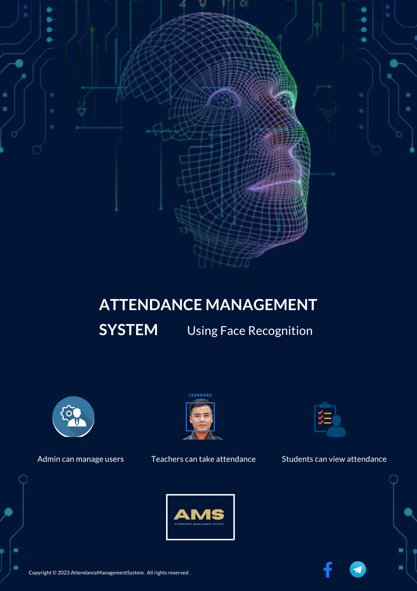

Attendance plays a crucial role in schools and colleges, but many educational institutions still rely on traditional methods like roll calls and manual attendance sheets. These methods are time-consuming and prone to errors. Our objective is to develop an attendance management system that simplifies and automates the process using face recognition technology, aiming to digitalize the existing system for improved efficiency and security. Attendance management systems have evolved from manual methods to automated and sophisticated systems. Face recognition technology has emerged as an efficient way to automate attendance tracking. It uses biometric identification to capture and verify an individual's identity by analyzing their facial features. The technology eliminates manual tracking, prevents proxy attendance, enhances security, and saves time. Overall, the use of face recognition technology has revolutionized attendance tracking, making it more accurate, efficient, and secure. The attendance management system is a web-based application with three user types: admin, staff, and students. The admin has the authority to manage staff, students, subjects, courses, and sessions. Staff members can easily manage attendance records and approve leave requests, while students have access to view their attendance and apply for leave.

<h1>Poster<h1>
 

<h1>Promotional video<h1>

